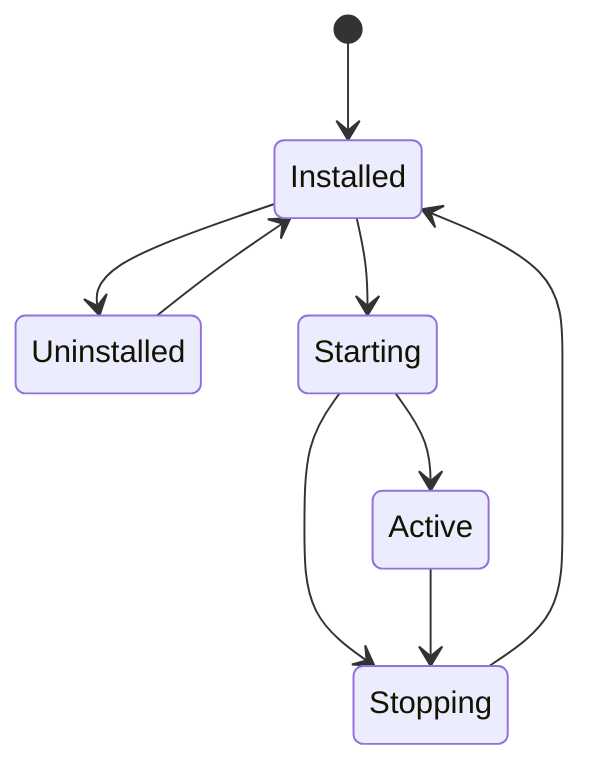
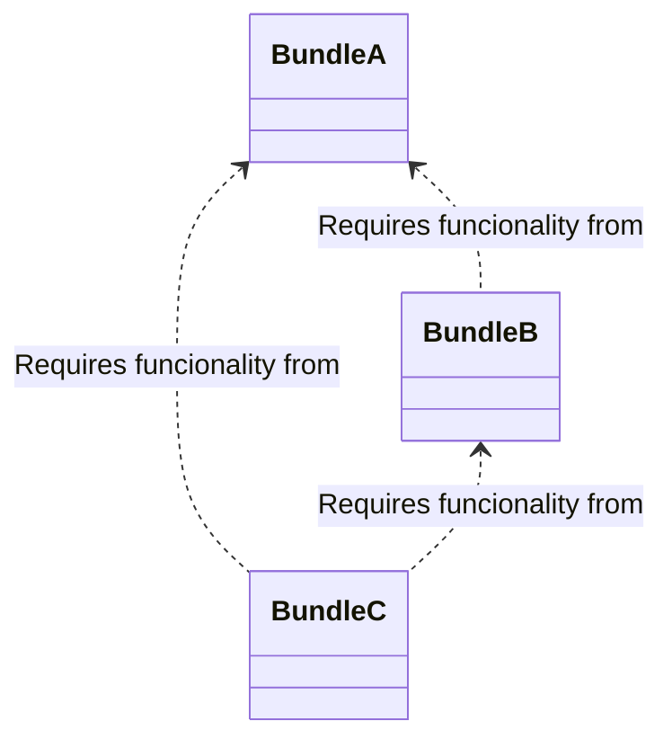

# Basics

## Understanding the main building blocks

### 1. Bundle

In Pandino a Bundle is a unit of modularization. A bundle is comprised of:
- A JSON descriptor containing details of a Bundle (Manifest Headers)
- At least one JavaScript file containing the actual code (Bundle Activator).

#### 1.1. Bundle Manifest Headers

Manifest Headers can be used by bundle developers to supply descriptive information about a Bundle.

#### 1.2. Bundle Lifecycle

Bundle lifecycle in Pandino is a simplified/modified version of the OSGi Bundle lifecycle.



**Installed**

A Bundle goes to an `Installed` state when it's JavaScript code has been loaded successfully, or when it has been
stopped.

**Starting**

A Bundle changes state to `Starting` once all of it's pre-defined dependencies are met, and it's `activate()` method has
been called. Any Bundle failing to activate briefly transitions to the `Stopping` state.

**Active**

When a Bundle's `activate()` method has successfully ran, the `Starting` concludes, and the Bundle transitions to the
`Active` state.

> A Bundle's pre-defined `Providers` are only considered usable by the Framework if their host Bundle is in the `Active`
state!

**Stopping**

A Bundle can go to the `Stopping` state either when it's `stop()` method has been pragmatically called, or when it
fails to `activate()`.

Successful stopping results in the Bundle transitioning to the `Installed` state.

**Uninstalled**

The main differences between `Installed` and `Uninstalled` states are: if a Bundle ends up in a state of `Uninstalled`,
then it no longer participates in the Bundle resolution process, which means that even it's dependencies are satisfied
and resolved, it still won't be considered usable by the Framework. This means that other Bundles depending on such
Bundle won't ever start.

The only state a Bundle can transition from `Uninstalled` to is `Installed`, via programmatically re-installing it.

#### 1.2. Bundle Types

By default Pandino supports ESM Bundles. Support for additional `BundleType`s can be registered with the framework.
A detailed description can be found in the [Activator Resolvers](./advanced/activator-resolvers.md) covering this topic.

### 2. Service

Bundles are built around a set of cooperating Services available from a shared Service Registry. Such a Pandino service
is defined semantically by its Service Interface and implemented as a Service Object.

The Service Object is owned by, and runs within, a Bundle. This Bundle must register the Service Object with the
Pandino Service Registry so that the service's functionality is available to other Bundles under the control of Pandino.

Dependencies between the Bundle owning the Service and the Bundles using it are managed by the Framework. For example,
when a Bundle is stopped, all the Services registered with Pandino by that Bundle must be automatically unregistered.

Pandino also provides an event mechanism so that bundles can receive events of Services that are registered, modified,
or unregistered.

#### 2.1 Service References

In general, registered service objects are referenced through `ServiceReference` objects. This avoids creating
unnecessary dynamic service dependencies between bundles when a bundle needs to know about a service but does not
require the service object itself.

A `ServiceReference` object can be stored and passed on to other bundles without the implications of dependencies.
A `ServiceReference` object encapsulates the properties and other meta-information about the service object it
represents. This meta-information can be queried by a bundle to assist in the selection of a service that best suits its
needs.

#### 2.2 Service Interfaces

A service interface is the specification of the service's public methods.

In practice, a bundle developer creates a service object by implementing its service interface and registers the service
object with the Framework service registry via a `string` representing the interface.

> Since JavaScript does not support interfaces on a language level, we need to manually maintain a `string ` to
> `interface` pairing.

Once a bundle has registered a service object under an interface name, the associated service can be acquired by bundles
under that interface name.

When requesting a service object from the Framework, a bundle can specify the name of the service interface that the
requested service object must implement. In the request, the bundle may also specify a filter string to narrow the
search.

One class may implement multiple interfaces therefore when such service needs to be registered, we can do so by
providing a `string[]` representing each interface. On a consumer side, we can of course still obtain a
`ServiceReference` object corresponding to a single interface by requesting a service object by only one of it's
interface-representing strings.

#### 2.3 Service Properties

Properties hold information as key/value pairs. The key must be a `string` and the value should be a type recognized by
`Filter` objects. Multiple values for the same key are supported with arrays ([]).

The values of properties should be limited to primitive types to prevent unwanted inter bundle dependencies.

The key of a property is **case sensitive**. ObjectClass, OBJECTCLASS and objectclass are **NOT** the same property
keys.

The service properties are intended to provide information about the service. The properties should not be used to
participate in the actual function of the service. Modifying the properties for the service registration is a
potentially expensive operation.

The Filter interface supports complex filtering; it can be used to find matching services. Therefore, all properties
share a single namespace in the Framework service registry. Filter strings MUST adhere to LDAP standard filter patterns,
e.g.: `(|(someProp=test)(someProp=test-other))`

#### 2.4 Service Scopes

Currently, there are two types of scopes supported:

- `SINGLETON`
- `PROTOTYPE`

**SINGLETON**:

Whenever a developer tries to obtain a service via calling `bundleContext.getService<any>(reference)`, the framework
will always provide the same reference of the registered service.

**PROTOTYPE**:

Whenever a developer tries to obtain services via calling:

```typescript
const serviceObject = bundleContext.getServiceObjects<any>(reference);
const service1 = serviceObject.getService();
const service2 = serviceObject.getService();
```

the framework will provide a new instance from the registered `ServiceFactory<any>` for every `serviceObject.getService()`
call.

> Registration and handling of different scoped services will be discussed in a more detailed way later. In the meantime
> behavior can be observed in the corresponding tests: [bundle-context-impl.test.ts](../packages/@pandino/pandino/src/lib/framework/bundle-context-impl.test.ts)

## Diving deeper

### Bundle Requirements and Capabilities

#### Provided Capabilities

A Bundle can define `0..*` "Capabilities" in it's Manifest, which is/are `string` / `string[]` values representing any
functionality provided by the Bundle. This string can be anything, the Bundle developer decides what these values are.

```json
{
  "Provide-Capability": "@scope/some-functionality;prop1=\"value1\";prop2=123"
}
```

In order for Bundles to further specify their capabilities, the capabilities can have additional attributes (separated
by semicolons), which Bundle consumers can use to filter for specific behavior if multiple bundles provide the same
functionality, but with different details (these are the `prop1` and `prop2` values in the example above).

#### Required Capabilities

A Bundle can define `0..*` required capabilities which it needs for it to be able to start. These are `string` /
`string[]` values.

```json
{
  "Require-Capability": "@scope/some-functionality;filter:=\"(prop2>=100)\""
}
```

When we would like to specify a required capability we can add an extra `filter` `directive` where we can fine-grain our
search criteria if needed. This filter **MUST** be in an LDAP filter compatible format!

#### Concrete example

Let's say we would like to achieve the following:



**bundle-a-manifest.json**:

```json
{
  "Bundle-ManifestVersion": "1",
  "Bundle-SymbolicName": "@example/bundle-a",
  "Bundle-Name": "Bundle A",
  "Bundle-Version": "0.1.0",
  "Bundle-Activator": "./bundle-a.js",
  "Provide-Capability": "@example/functionality;version=\"0.1.0\";bool-prop=true"
}
```

**bundle-b-manifest.json**:

```json
{
  "Bundle-ManifestVersion": "1",
  "Bundle-SymbolicName": "@example/bundle-b",
  "Bundle-Name": "Bundle B",
  "Bundle-Version": "1.4.12",
  "Bundle-Activator": "./bundle-b.js",
  "Provide-Capability": "@example/another-functionality;version=\"1.4.12\"",
  "Require-Capability": "@example/functionality;filter:=\"(&(version>=0.1.0)(bool-prop=true))\""
}
```

**bundle-c-manifest.json**:

```json
{
  "Bundle-ManifestVersion": "1",
  "Bundle-SymbolicName": "@example/bundle-c",
  "Bundle-Name": "Bundle C",
  "Bundle-Version": "0.0.12",
  "Bundle-Activator": "./bundle-c.js",
  "Require-Capability": [
    "@example/functionality;filter:=\"(version=0.1.0)\"",
    "@example/another-functionality;filter:=\"(version=*)\""
  ]
}
```

Please note that in case of `bundle-c-manifest.json` we do not define any `Provide-Capability` properties which is
completely fine if we do not want to allow other bundles to depend on it.
